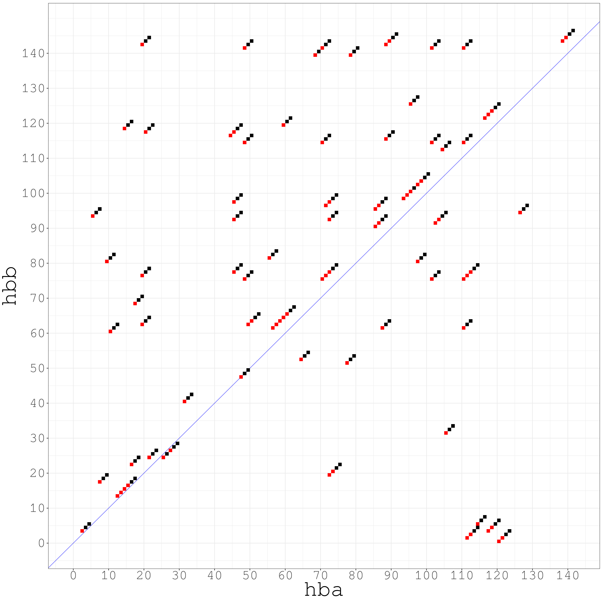

# Dotmatch between HBA and HBB

## Reference

* EBI EMBOSS dotmatcher: <http://embossgui.sourceforge.net/demo/manual/dotmatcher.html>
* Online dotmatcher: <https://www.ebi.ac.uk/Tools/seqstats/emboss_dotmatcher/>

## Data

* `BLOSUM62` is downloaded from: <ftp://ftp.ncbi.nlm.nih.gov/blast/matrices/BLOSUM62>
* `HBA.fa` and `HBB.fa` are extracted from: <ftp://ftp.ncbi.nlm.nih.gov/refseq/H_sapiens/annotation/GRCh37_latest/refseq_identifiers/GRCh37_latest_protein.faa.gz>

## Plot

